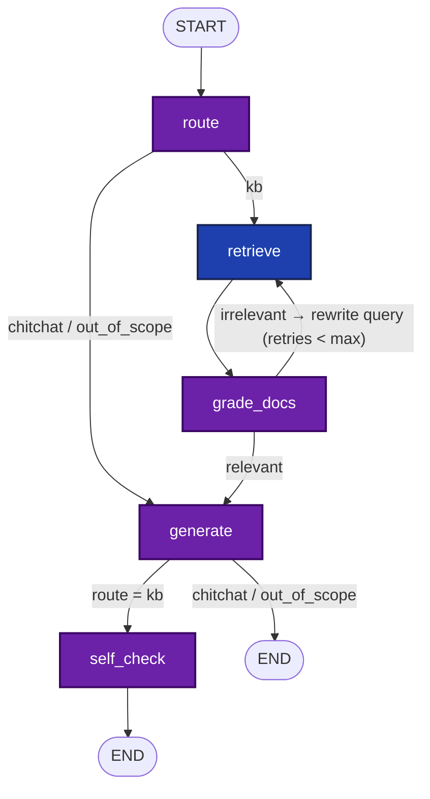
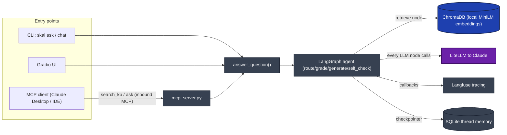

# Architecture

Visual reference for the agent core. Diagrams are Mermaid (render on GitHub).
The agent graph mirrors the real compiled topology
(`build_graph(...).get_graph().draw_mermaid()`).

## 1. Agent graph (LangGraph `StateGraph`)

A deterministic state machine — **not** a ReAct/tool-calling loop. Edges are
chosen by code reading state, not by the model.

🟣 purple = calls the LLM · 🔵 blue = deterministic code, no LLM call

| Node | LLM? | Role |
|---|---|---|
| `route` | ✅ LLM | Classifies → `kb` / `chitchat` / `out_of_scope`; skips retrieval for the last two |
| `retrieve` | ❌ no LLM | Vector search over ChromaDB (`kb.query`, optional `source_type` filter) — the only internal tool, plain Python |
| `grade_docs` | ✅ LLM | Relevance gate; if weak → rewrites the query and loops back (corrective RAG), bounded by `max_retries` |
| `generate` | ✅ LLM (usually) | Synthesizes an answer with `[source_id]` citations. Exception: the `out_of_scope` branch returns a static string with **no LLM call** |
| `self_check` | ✅ LLM (usually) | Groundedness guard: hedges only with no evidence, or when grader **and** verifier both say ungrounded. Exception: skips the LLM call entirely when there's no answer/no docs (nothing to verify) |

So **4 of 5 nodes are LLM calls**; `retrieve` is the one purely-deterministic node (a Chroma query, no model involved). `generate`/`self_check` each have one non-LLM shortcut branch, noted above.

Shared `AgentState` (a `TypedDict`) is patched by each node:
`question, messages, source_type, route, docs, docs_ok, answer, citations, grounded, retries`.
`messages` uses LangGraph's `add_messages` reducer and is persisted per `thread_id`
by a SQLite checkpointer → multi-turn memory.

## 2. Component interaction (tools, LLM, MCP direction)

The agent's only internal tool is the vector store, called deterministically in
`retrieve`. **MCP runs the other direction**: `mcp_server.py` *exposes* skai to
external MCP clients as tools — it is not something the agent calls.

🟣 purple = the LLM itself · 🔵 blue = a tool the agent calls (vector store) ·
⚪ grey = orchestration/infra — no model reasoning happens here (MCP server,
`answer_question`, the LangGraph wrapper itself, SQLite memory, Langfuse tracing)

- **Inbound:** skai is a tool others call (`search_kb`, `ask`) over MCP.
- **Outbound:** the agent calls no MCP tools and uses no model function-calling —
  retrieval is a hard-wired node. Same core functions back the CLI, UI, and MCP.

## 3. One `kb` turn (sequence)

```mermaid
sequenceDiagram
    participant U as User
    participant G as LangGraph
    participant L as Claude (LiteLLM)
    participant C as ChromaDB

    U->>G: question (thread_id)
    G->>L: route → "kb"
    G->>C: retrieve top-k (+source filter)
    C-->>G: chunks
    G->>L: grade_docs relevant?
    alt irrelevant and retries < max
        G->>L: rewrite query
        G->>C: retrieve again
    end
    G->>L: generate answer + [citations]
    G->>L: self_check grounded?
    G-->>U: answer + citations + route
```

Rationale for graph-orchestration over a tool-calling agent (inspectable,
bounded, testable control flow) is decisions **D1 / D10** in
[`DECISIONS.md`](DECISIONS.md).
