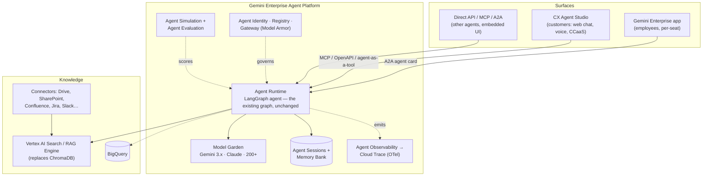

# Running Solid Knowledge AI on Gemini Enterprise CX & the Google stack

**Date:** 2026-08-27 · **Status:** proposal, design-only (nothing built, nothing committed to GCP)
**Companion docs:** [`CAPABILITY-ROADMAP.md`](CAPABILITY-ROADMAP.md) (what it should do),
[`superpowers/specs/2026-08-26-scaling-multi-source-design.md`](superpowers/specs/2026-08-26-scaling-multi-source-design.md) (how much it holds),
[`ARCHITECTURE.md`](ARCHITECTURE.md) (what exists).

> Product names and capabilities below were checked against Google Cloud
> documentation and blog posts as of **2026-08-27**. Google renamed most of this
> surface in April 2026; anything you remember as "Vertex AI Agent Builder",
> "Agent Engine", or "Dialogflow CX" now lives under a different name. Pricing
> figures are **indicative only** — several come from secondary sources and must
> be confirmed on the official pricing pages linked at the end.

---

## 1. First: which "Gemini Enterprise" is this?

Three adjacent products share the name. Picking the wrong one is the most expensive
mistake available here, so they are separated before anything else.

| Product | What it is | Who it serves | Billing shape |
|---|---|---|---|
| **Gemini Enterprise** (the app) | An employee-facing workspace: permission-aware search over 100+ SaaS connectors, an agent gallery, Deep Research, NotebookLM, governance | Your staff | **Per seat / month** |
| **Gemini Enterprise Agent Platform** | The build/run/govern platform — the April 2026 evolution of Vertex AI. ADK, Agent Runtime, Model Garden, Agent Identity/Registry/Gateway, Simulation & Evaluation | Your engineers | **Consumption** (tokens, runtime, storage) |
| **Gemini Enterprise for CX** | The customer-experience suite: **CX Agent Studio**, Agent Assist, CX Insights, Commerce Agents. Lineage: Dialogflow CX → Conversational Agents → CX Agent Studio | Your customers, and the humans who serve them | **Per session** (chat or voice) |

**They compose.** You build the agent on the Agent Platform, then *surface* it in
Gemini Enterprise (for employees, via A2A registration) and/or in CX Agent Studio
(for customers, via chat and voice channels). This is not an either/or choice, and
the port plan below assumes the composition.

**Decision this forces:** who talks to the bot first? Employees → Gemini Enterprise
seats. Customers → CX sessions. Human support agents → Agent Assist. The answer
changes the licence model, the SLO, and roughly half of Phase 4 below.

---

## 2. Recommended target architecture



**The load-bearing decision: keep the LangGraph agent, do not rebuild it as a
playbook.** The value of this codebase is the corrective/self-reflective control
flow — bounded retries, an explicit relevance gate, a groundedness verifier, honest
refusal — and it is explicit, testable code. Re-expressing it as CX Agent Studio
playbook instructions converts deterministic edges into prompt text you cannot unit
test. Agent Platform runs LangGraph natively, so there is no reason to pay that price.

CX Agent Studio still earns its place — as the **channel and containment layer**
(voice, telephony, CCaaS, escalation to a human, session analytics, versioning and
one-click rollback), calling the LangGraph agent as a tool. Studio supports MCP
tools, OpenAPI tools, and "agent as a tool", so all three wiring options exist.

### Alternatives considered

| Option | Verdict |
|---|---|
| **A. Lift LangGraph onto Agent Runtime** (recommended core) | Keeps all IP and tests; port is mostly config because the seams already exist |
| **B. Rebuild natively as a CX playbook** | Fastest to a voice channel, but discards the control flow that makes this project distinctive, and hard-locks it in |
| **C. Rebuild natively in ADK** | Reasonable if the team standardises on ADK org-wide. Same rewrite cost as B without B's channel payoff. Note Agent Studio (low-code) exports to ADK, so this stays open later |
| **D. Stay on the current stack; integrate via MCP only** | Cheapest, and legitimate if GCP is not mandatory. You forgo permission-aware connectors, governance, and the channel layer |

**A + CX as the front door** is the recommendation. **D** is the honest fallback if
the driver is "we want a Google story" rather than a real requirement — say so early.

---

## 3. Component mapping — what actually changes in this repo

The port is small because the abstractions needed already exist: `Store`,
`make_llm`, `get_callbacks`, and node dependency injection. Nothing in
`agent/graph.py`, `agent/nodes.py`, or `agent/prompts.py` needs to change.

| Today | Google target | Change size | Notes |
|---|---|---|---|
| `agent/llm.py` — LiteLLM → Anthropic direct | **Model Garden** via LiteLLM's `vertex_ai/…` prefix | **~1 line + config** | LiteLLM routes Claude on Vertex as `vertex_ai/claude-…@YYYYMMDD`, and Gemini as `vertex_ai/gemini-…`. `MODEL_ALIASES` in `config.py` is the only edit; `ChatLiteLLM` and the Langfuse callback stay |
| `ingest/store.py` — Chroma | **Vertex AI Search** (turnkey, ACL-aware) *or* **RAG Engine** (managed pipeline over Vector Search 2.0) *or* **Vector Search 2.0** (raw ANN) | one class behind the existing `Store` API | Recommend **Vertex AI Search** if the corpus is enterprise documents needing permission-aware retrieval; **RAG Engine** if you want to keep control of chunking and rerank. Vector Search only if you are hand-rolling the pipeline |
| Local MiniLM embeddings | `gemini-embedding-*` on Vertex, or managed inside AI Search / RAG Engine | config | Costs money and adds a network hop; managed retrieval hides it entirely |
| `make_checkpointer` — `SqliteSaver` | **Cloud SQL for PostgreSQL** checkpointer (`langchain-google-cloud-sql-pg`, `PostgresSaver`) or **Agent Sessions** | ~20 lines | `LanggraphAgent` accepts `checkpointer_builder` + `checkpointer_kwargs`; single-writer SQLite is a hard blocker for concurrency regardless of cloud |
| — (no long-term memory) | **Agent Memory Bank** | new | Delivers roadmap §3.8 without building it |
| `observability.py` — Langfuse | **Agent Observability** → Cloud Trace, OpenTelemetry format. `LanggraphAgent(..., enable_tracing=True)` | ~10 lines | Keep Langfuse in parallel: it ingests OTLP. Requires the Telemetry API and Logging API enabled |
| `evals/` — DeepEval | **Agent Evaluation** (multi-turn autoraters on live traffic) + **Agent Simulation** (synthetic users, virtualised tools) | additive | Keep DeepEval as the offline CI gate; add the managed pair for pre-prod simulation and production scoring |
| `mcp_server.py` | MCP tool registration in CX Agent Studio; **Agent Gateway** for policy | ~0 | The MCP server already fits. Gateway adds Model Armor and consistent auth in front of it |
| `ui.py` — Gradio | Gemini Enterprise app UI (nothing to build) / CX web widget / Cloud Run for custom | delete or keep for dev | Gradio stays useful as a local dev harness |
| `.env` | **Secret Manager** + Terraform; app config via runtime env | small | No API keys in the image |
| `feedback.sqlite` | BigQuery (or Firestore) + **CX Insights** | ~30 lines | Insights gives topic clustering and KPIs for free on the CX side |
| `source_type` filter | Metadata filters + **permission-aware search** with real ACLs | see scaling spec §5.8 | Gemini Enterprise connectors carry source ACLs through to retrieval — this is the single biggest thing you get for free |
| — (no governance) | **Agent Identity** (cryptographic per-agent ID), **Agent Registry**, **Agent Gateway**, Model Armor, anomaly/threat detection | new | Covers roadmap §3.2 guardrails and §5 audit largely off-the-shelf |

### Deployment shape

`LanggraphAgent` from the Agent Platform SDK wraps a graph; deployment goes through
`client.agent_engines.create` from one of: source packages, a Developer Connect git
repo, or a Dockerfile honouring the runtime contract. The Dockerfile path is the one
to plan for — this project has native dependencies and a `uv.lock` worth preserving.

```python
# sketch only — not committed
agent = agent_engines.LanggraphAgent(
    model="gemini-3.1-flash",              # or a Claude model id from Model Garden
    checkpointer_builder=..., checkpointer_kwargs=...,   # Cloud SQL Postgres
    enable_tracing=True,                   # → OTel → Cloud Trace
)
```

Custom graphs use the template contract (`set_up` / `query` / `stream_query` /
`register_operations`) rather than the stock `LanggraphAgent`; `build_graph()` maps
onto `set_up` almost directly.

---

## 4. Requirements

### 4.1 Organisational / commercial

- GCP organisation, folder, and project structure; billing account with a budget and
  alerts before the first deploy.
- **Licences**: Gemini Enterprise seats for employee use (Business / Standard / Plus;
  a Frontline tier exists for deskless staff but requires ≥150 Standard or Plus seats).
  CX is **per session**, so employee and customer use are on different meters.
- Named owners: platform owner, corpus owner, security reviewer, and the person who
  acts on the retrieval-gap report (roadmap §3.3). The last one is the most commonly
  skipped and the most consequential.
- Legal: DPA, data-residency commitments, retention policy for conversations and traces.

### 4.2 Identity & access — the real prerequisite

- An identity source (Cloud Identity, or Workforce Identity Federation to your IdP).
  **Permission-aware search only works if group membership is resolvable**, so this
  blocks the highest-value feature.
- Per-connector admin consent for each SaaS hub (Drive, SharePoint, Confluence, Jira,
  Slack…). Each has its own approval path and its own lead time — start these on day one.
- IAM roles for humans; **Agent Identity** for the agent itself, least-privilege.
- Service-account strategy for the Runtime: which datasets, which write actions.

### 4.3 Security & compliance

- VPC Service Controls perimeter; CMEK if key control is required; Private Service
  Connect for the data path.
- **Model Armor** via Agent Gateway for prompt-injection and jailbreak filtering —
  this discharges most of roadmap §3.2 without custom code.
- DLP / de-identification on ingest for PII-bearing corpora.
- Audit logging retention; Security Command Center integration via the Agent Security
  Dashboard.
- Region pinning for both data and model serving; confirm the chosen models are
  available in the required region (Claude on Vertex is region-limited).

### 4.4 Functional & operational

- Latency SLO (p95 answer, first token) and, for CX, a **containment rate** target
  plus a defined escalation path to a human.
- Languages and channels required (CX Agent Studio playbooks support 38 languages;
  telephony via AudioCodes, Five9, Google Telephony Platform, Twilio).
- Quota planning: tokens/min, sessions/day, index size, concurrent conversations.
- Rollback plan — CX Agent Studio provides versioning, changelogs, and one-click
  rollback; the Runtime side needs its own versioned deploy.

---

## 5. Migration plan

Each phase ships something runnable and has an exit criterion that is checkable, not
a feeling. Durations are for one engineer with GCP access already granted.

| Phase | Work | Duration | Exit criterion |
|---|---|---|---|
| **0 — Landing zone & spike** | Project, IAM, budget alerts, APIs enabled (Telemetry, Logging), Model Garden access for the chosen models. Spike: run the existing graph locally against `vertex_ai/…` | 3–5 d | `skai ask` answers correctly with **zero code changes beyond `MODEL_ALIASES`** |
| **1 — Model + retrieval swap** | Point LiteLLM at Vertex; implement `VertexSearchStore` (or `RagEngineStore`) behind the existing `Store` interface; migrate the corpus | 2–3 wks | DeepEval suite passes at **parity or better** vs the Anthropic/Chroma baseline. This is the go/no-go gate |
| **2 — Deploy to Agent Runtime** | Package via Dockerfile; Cloud SQL Postgres checkpointer; `enable_tracing=True`; Secret Manager; CI deploy | 2 wks | Agent answers over the deployed endpoint; traces visible in Cloud Trace; 10 concurrent sessions with no checkpointer contention |
| **3 — Employee surface** | Publish an A2A agent card (Gemini Enterprise supports A2A v0.3 streaming); register the agent; wire permission-aware connectors for the first hub | 1–2 wks | Agent discoverable in the Agent Gallery; a restricted document is provably **not** returned to a user without access |
| **4 — Customer surface (CX)** | CX Agent Studio playbook fronting the agent (MCP or OpenAPI tool); web chat channel; escalation to human; then voice/telephony | 3–4 wks | A real conversation completes end to end on chat; containment measured in CX Insights; voice as a follow-on |
| **5 — Govern & optimise** | Agent Registry + Gateway + Identity; Agent Simulation in CI; Agent Evaluation on live traffic; Agent Optimizer on clustered failures | ongoing | Simulation runs on every PR; a prompt change is shipped that was *proposed by* failure clustering, not by hand |

**Phase 1 is the gate.** If retrieval quality on Vertex AI Search does not match the
tuned Chroma baseline, everything downstream is built on a regression — and you will
not be able to tell, because the current 4-question eval scores 1.0 on everything.
Do roadmap §3.4 (real evaluation) **before or during** Phase 1, not after.

### Parallel tracks

- Connector admin consent (§4.2) — starts at Phase 0, has external lead time.
- Roadmap §3.4 evaluation — must land before Phase 1's exit criterion means anything.
- Roadmap §3.1 streaming — do it during Phase 2; the Runtime contract has
  `stream_query` and the CX voice channel effectively requires it.

---

## 6. Cost model

Three meters, and they are easy to conflate:

| Meter | Applies to | Indicative rate |
|---|---|---|
| **Seats** | Gemini Enterprise app (employees) | Business from ~$21/seat/mo; Standard ~$30 (annual commit) / ~$35; Plus ~$50 (annual) / ~$60. Frontline for deskless staff needs ≥150 Standard/Plus seats |
| **Sessions** | CX Agent Studio (customers) | Per session, chat or voice. A session that starts as chat and moves to voice bills entirely as **voice**. Voice overage around **$0.0025/second beyond 300 s** |
| **Consumption** | Agent Platform: model tokens, Runtime execution, index storage, connector sync | Metered; overage applies **on top of** seat subscriptions once quotas are exceeded |

> All figures above are indicative and partly from secondary sources. Confirm on the
> official pricing pages before any commitment.

Cost levers worth designing in now, cheapest first:

1. **Model tiering per node** — `route` and `grade_docs` on a Flash-class model,
   `generate` on the strong one. `config.py` already resolves models by alias; it just
   needs a per-node knob. Typically the largest single saving.
2. **Drop `grade_docs` in favour of a rerank score gate** (scaling spec §5.4) — removes
   one LLM call per turn on the hot path.
3. **`self_check` conditionally**, only when retrieval confidence is low, rather than
   every `kb` turn.
4. **Caching** — embedding cache keyed by content hash, semantic query cache, rerank cache.
5. **Chat-before-voice** in CX flows where possible, given the voice billing rule above.

Items 1–3 together roughly halve the per-answer LLM cost of the current graph and cut
latency at the same time.

---

## 7. Risks

| Risk | Impact | Mitigation |
|---|---|---|
| Retrieval regresses on managed search vs the tuned local baseline | Silent quality loss | Phase 1 gate + real retrieval metrics (recall@k / MRR) before migrating, not after |
| Product churn — this surface was renamed wholesale in April 2026 | Docs and skills go stale mid-project | Keep the port behind existing seams (`Store`, `make_llm`); pin SDK versions; re-verify names at each phase boundary |
| Lock-in | Hard to leave | Control flow stays in portable LangGraph code; only adapters are Google-specific. Preserve the `Store` interface as the escape hatch |
| Claude region/quota limits on Vertex | Phase 0 blocker | Verify model availability per region during the spike; Gemini 3.x as the fallback — the graph is model-agnostic by construction |
| Connector consent takes months | Phase 3 slips | Start on day one; sequence hubs by value; ship with one hub |
| Per-session CX billing surprises on voice | Budget overrun | Model the voice-overage rule explicitly; budget alerts before the first public channel |
| Two eval systems (DeepEval + Agent Evaluation) disagree | Nobody trusts either | Declare DeepEval the offline CI gate and Agent Evaluation the production monitor; align the judges once and record the agreement rate |
| Rebuild pressure ("just use a playbook") | Loses the differentiating IP | This document is the argument; revisit only if the graph proves to be the bottleneck |

---

## 8. Open decisions

1. **Audience first**: employees (Gemini Enterprise seats), customers (CX sessions),
   or human support agents (Agent Assist)? Everything downstream depends on this.
2. **Retrieval tier**: Vertex AI Search (turnkey, permission-aware) vs RAG Engine
   (keeps chunking and rerank control)? Decide with a bake-off during Phase 1 rather
   than on paper.
3. **Model**: stay on Claude via Model Garden (zero prompt-tuning risk) or move to
   Gemini 3.x (better platform integration, cheaper Flash tier)? Cheap to test — run
   the eval suite against both in Phase 0.
4. **Framework**: keep LangGraph long-term, or converge on ADK once the team
   standardises? Recommend LangGraph now, keep the ADK door open (Agent Studio exports to it).
5. **Observability**: Cloud Trace only, or dual-export to Langfuse over OTLP?
   Dual-export while the team's muscle memory is in Langfuse; consolidate later.
6. **CX wiring**: expose the agent to CX Agent Studio as an MCP tool, an OpenAPI tool,
   or agent-as-a-tool? All three are supported; pick on auth and latency, and prototype
   in Phase 4.

---

## Sources

Checked 2026-08-27.

- [Introducing Gemini Enterprise Agent Platform](https://cloud.google.com/blog/products/ai-machine-learning/introducing-gemini-enterprise-agent-platform) — Build/Scale/Govern/Optimize capability set, GA April 2026, evolution of Vertex AI
- [Gemini Enterprise Agent Platform docs](https://docs.cloud.google.com/gemini-enterprise-agent-platform) · [Agent Runtime](https://docs.cloud.google.com/gemini-enterprise-agent-platform/build/runtime) · [Create a LangGraph agent](https://docs.cloud.google.com/gemini-enterprise-agent-platform/build/runtime/create-a-langgraph-agent) · [Deploy an agent](https://docs.cloud.google.com/gemini-enterprise-agent-platform/scale/runtime/deploy-an-agent) · [Set up tracing](https://docs.cloud.google.com/gemini-enterprise-agent-platform/scale/runtime/tracing) · [Observability overview](https://docs.cloud.google.com/gemini-enterprise-agent-platform/optimize/observability/overview)
- [Gemini Enterprise for CX docs](https://docs.cloud.google.com/gemini-enterprise-cx) · [CX Agent Studio](https://docs.cloud.google.com/gemini-enterprise-cx/cx-agent-studio) · [CX Agent Studio tools](https://docs.cloud.google.com/gemini-enterprise-cx/cx-agent-studio/tool) · [Flow-based agents](https://docs.cloud.google.com/gemini-enterprise-cx/cx-agent-studio/flow) · [Agent Assist](https://docs.cloud.google.com/gemini-enterprise-cx/agent-assist) · [CX Insights](https://docs.cloud.google.com/gemini-enterprise-cx/insights)
- [Register and manage A2A agents in Gemini Enterprise](https://docs.cloud.google.com/gemini/enterprise/docs/register-and-manage-an-a2a-agent) · [Import A2A agents from Agent Registry](https://docs.cloud.google.com/gemini/enterprise/docs/import-govern-agent-registry) · [Compare Gemini Enterprise editions](https://docs.cloud.google.com/gemini/enterprise/docs/editions)
- [Dialogflow release notes](https://docs.cloud.google.com/dialogflow/docs/release-notes) — CX console deprecated 2025-10-31, routed to Conversational Agents · [Playbooks](https://cloud.google.com/dialogflow/cx/docs/concept/playbook) · [Data store tools](https://docs.cloud.google.com/dialogflow/cx/docs/concept/data-store/handler)
- [Vertex AI RAG Engine with Vector Search 2.0](https://docs.cloud.google.com/vertex-ai/generative-ai/docs/rag-engine/use-rag-managed-vertex-ai-vector-search) · [The GCP RAG spectrum](https://medium.com/google-cloud/the-gcp-rag-spectrum-vertex-ai-search-rag-engine-and-vector-search-which-one-should-you-use-f56d50720d5a)
- [LiteLLM — Vertex AI partner models (Anthropic, Model Garden)](https://docs.litellm.ai/docs/providers/vertex_partner) · [LiteLLM — Vertex AI Gemini](https://docs.litellm.ai/docs/providers/vertex)
- [Langfuse — OpenTelemetry / OTLP ingestion](https://langfuse.com/integrations/native/opentelemetry)
- Pricing (**verify before committing**): [CX Agent Studio pricing](https://cloud.google.com/products/gemini-enterprise-for-customer-experience/cx-agent-studio/pricing) · [Conversational Agents pricing](https://cloud.google.com/products/conversational-agents/pricing) · [Gemini Enterprise editions](https://docs.cloud.google.com/gemini/enterprise/docs/editions). Seat figures quoted in §6 come from secondary analyses ([Coworker AI](https://coworker.ai/blog/gemini-enterprise-pricing), [Cobry](https://cobry.ai/articles/gemini-enterprise-pricing)) and are indicative only.
